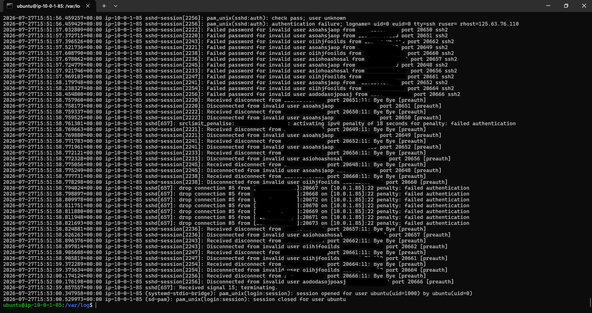
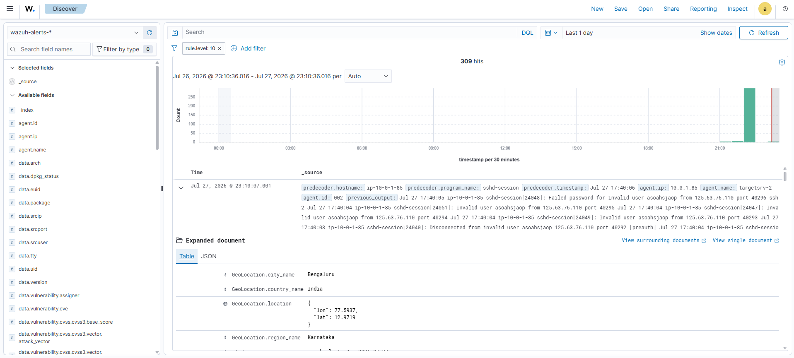
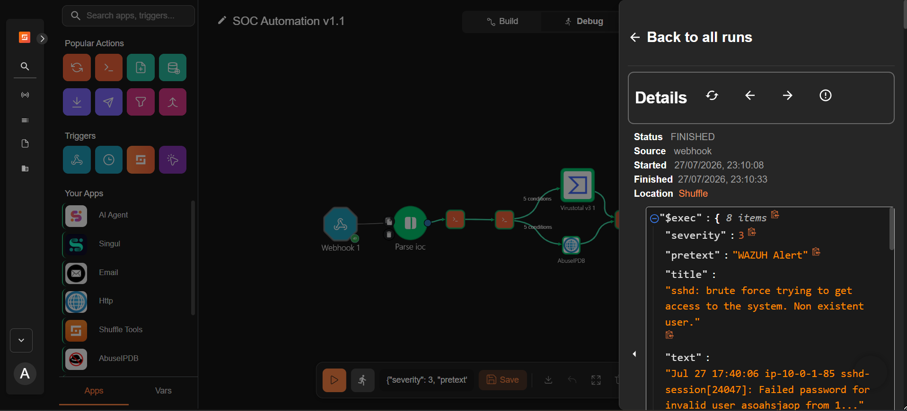
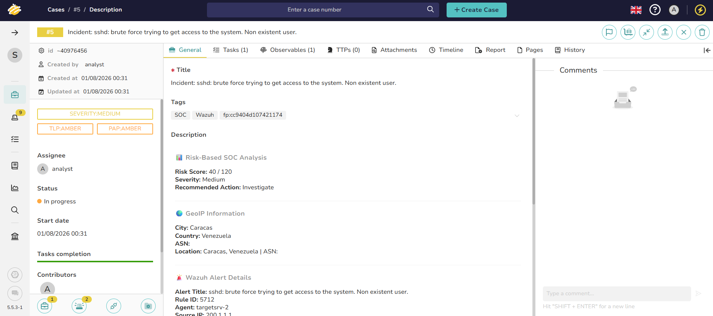
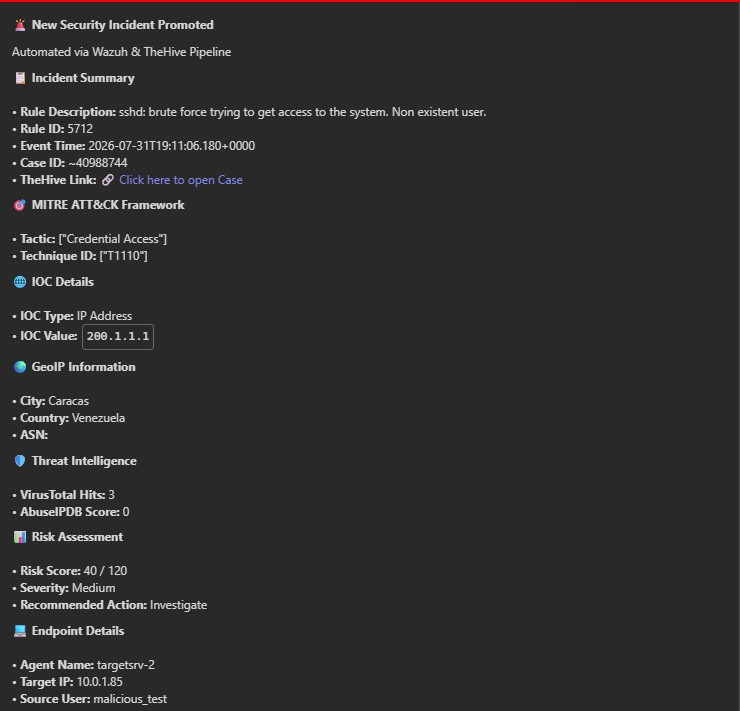

# 🚀 Automated SOC Alerting & Threat Intel Enrichment Pipeline

## Overview
A fully automated Security Operations Center (SOC) pipeline designed to ingest, parse, enrich, and triage security alerts. This architecture bridges Wazuh SIEM, Shuffle SOAR, and TheHive, significantly reducing Tier-1 analyst fatigue by delivering context-rich, deduplicated cases with integrated Threat Intelligence (TI) results.

## Key Engineering Achievements
* **Automated Threat Enrichment:** Integrated VirusTotal v3 and AbuseIPDB APIs to automatically analyze extracted observables (Public IPs) for real-time reputation scoring and malicious payload detection.
* **Deterministic Deduplication:** Engineered a custom Python aggregator that generates an MD5 fingerprint (Rule ID + Source IP) to query TheHive, dropping redundant executions and completely preventing "Race Conditions" and duplicate case spam.
* **Intelligent Alert Throttling:** Configured Wazuh agent rules and integration thresholds (Level > 7) to filter out internal network noise and prevent API exhaustion.
* **High-Speed Triage SLA:** Achieved a workflow execution and MS Teams notification delivery time of ~25 seconds from the moment of initial SIEM detection.

## Tech Stack
* **SIEM:** Wazuh & OpenSearch Dashboards
* **SOAR (Orchestration):** Shuffle (Webhooks, API Integration, Python Data Parsing)
* **Incident Management:** TheHive (Case creation, Observables, Automated Tasks)
* **Threat Intel (TI):** VirusTotal, AbuseIPDB
* **Notifications:** Microsoft Teams (Adaptive JSON MessageCards)

## Project Audit & Validation
* Successfully passed a 34-point functional architecture audit with 100% operational success, validating false-positive suppression, API failovers, private IP (RFC1918) dropping, and end-to-end data integrity. (See `Completed_SOC_Audit.pdf` in the `audit` folder).

* ## 📸 Pipeline Execution Evidence

### 1. Attack Detection at the OS Layer (Ubuntu /var/log/auth.log)

### 2. SIEM Ingestion & GeoLocation Parsing (Wazuh OpenSearch)

### 3. SOAR Execution Trace (~25 Second SLA)

### 4. Automated Incident Case Generation (TheHive)

### 5. Automated MS Teams Notification (Webhook)

